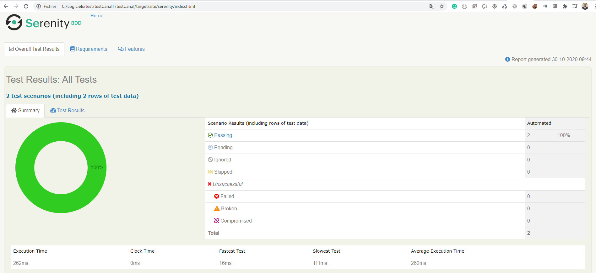
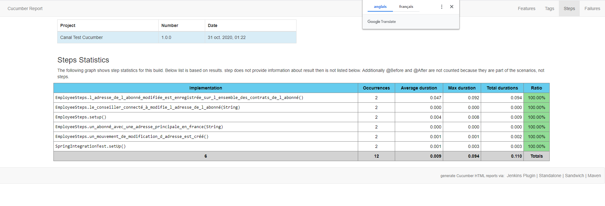
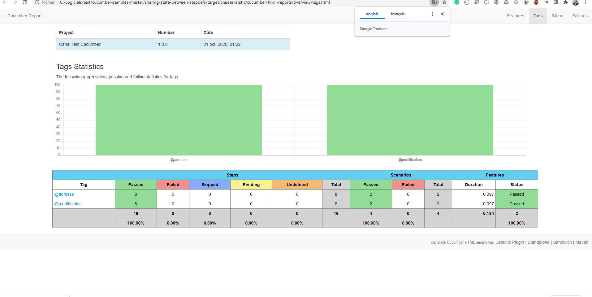
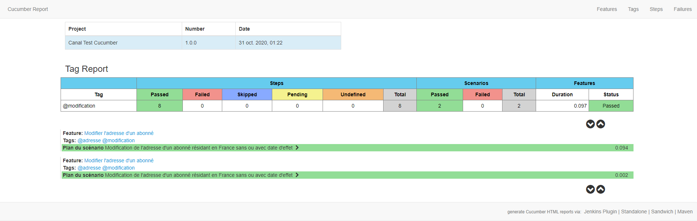

## Projet
Ce projet est réalisé dans le cadre d’un POC sur l’automatisation des tests. Il implémente l’automatisation d’un scenario du test de modification d’adresse d’un abonné.

## Environnement  
Cucumber 6.6.0  
Serinity 2.3.6  
JUnit 2.3.6  
Spring Test 5.2.8   
### Découpage des packages
la structure global du projet :
```Gherkin
src
  + main
    +java
      +dto                        les modèles d’interfaçage avec l’api
      +services                   les services d’appel des Api’s du backend 
  + test
    + java                        
      +config                     Configuration de l’environnement                         
      +parameterType              les paramètres d’input
      +stepDefinition             les classes des différentes étapes du test à exécuter 
    + resources
      + features                  les fichiers features

    
        
```
### Le scénario d'exemple
```Gherkin
  Fonctionnalité: Modifier l'adresse d'un abonné
  Plan du scénario: Modification de l'adresse d'un abonné résidant en France sans ou avec date d'effet
    Etant donné un abonné avec une adresse principale "<active>" en France
    Lorsque le conseiller connecté à "<canal>" modifie l'adresse de l'abonné
    Alors l'adresse de l'abonné modifiée est enregistrée sur l'ensemble des contrats de l'abonné Et un mouvement de modification d'adresse est créé
```
### implementation de screenplay
Le modèle de scénario décrit les tests en termes d'acteurs et les tâches qu'ils effectuent. Les tâches sont représentées comme des objets exécutés par un acteur, plutôt que comme des méthodes. Cela les rend plus flexibles et composables. Voici un exemple:
```java
     @Etantdonné("un abonné avec une adresse principale {string} en France")
     public void un_abonné_avec_une_adresse_principale_en_france(String isactive) {
         this.active=new Active(isactive);
 
 
     }
      @Lorsque("le conseiller connecté à {string} modifie l'adresse de l'abonné")
     public void le_conseiller_connecté_à_modifie_l_adresse_de_l_abonné(String canalName) {
         this.canal=new Canal(canalName);
         String requestResponse = subsciptionService.modifyAddress(canal.getCanalName(), active.getIsActive());
 
     }
```
### Installation
mvn clean install

### Exécution 
Lancer la class principale RunCucumberTest.java
Pour exécuter le projet, vous pouvez soit simplement exécuter la classe de test runner `RunCucumberTest.java`, soit exécuter ` mvn verify`
### Resultat 
Le sénario de test qui existe sous le dossier feature a été lancé  
Un rapport du test généré  situés dans target / site / serenity / index.html  



Des rapport plus detailée et interactif géneré par le plugin de cucumber-reporting dans target /  static  



